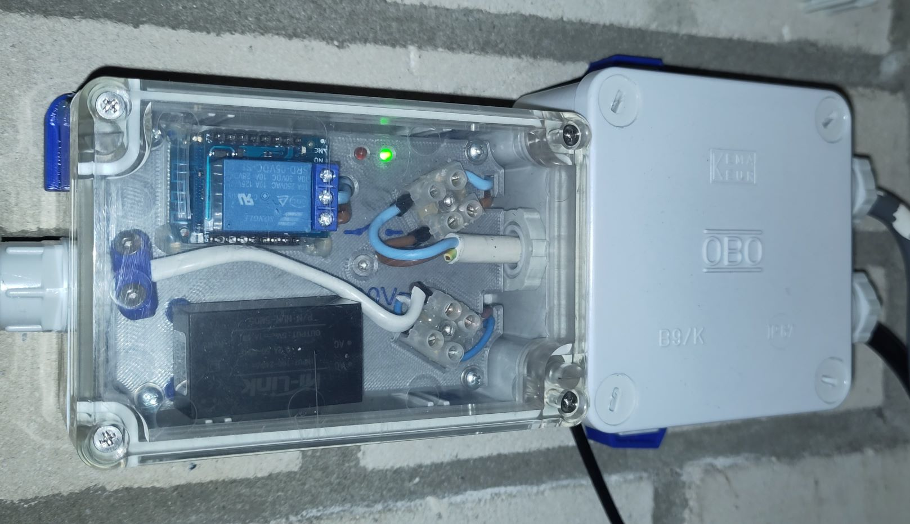

# Thermoswitch Heat Pump ↔ Auxiliary Boiler
A temperature controlled relay switch for a space heating solution by either a heat pump or by an auxiliary boiler connected in the system. The heating in such a system will automatically switch from heat pump to auxiliary boiler when the temperature drops below a certain temperature and vice versa.

I wanted to replace our old mechanical switching device (mounted outside) with a modern version (only temperature sensor outside). Using an ESP with a wired temperature sensor, relay and two LED's, I built this device:

<picture></picture>

It can be connected to a front end like Home Assistant. The red and green LED show the current state on the device itself, in case there is no front end connection. Most electronic connections are under the mounting plate. The temperature sensor cable goes out through an 8 mm hole in the wall. In the installation box on the right I can change connections back to the old device - just in case it doesn't work out with my device for some reason.

## Hardware used
+ Wemos D1 mini
+ Wemos Relay Shield
+ Waterproof DS18B20 (attention: cable length) + 4k7Ω resistor
+ 3 mm red and green LED + 2 resistors 220Ω
+ Power Supply ([HLK-5M05](https://www.tinytronics.nl/shop/nl/power/voedingen/5v/hi-link-pcb-voeding-5vdc-1a-hlk-5m05))
+ Waterproof housing ([Kradex Z57JJPH TM](https://www.tinytronics.nl/shop/en/tools-and-mounting/enclosures/universal/kradex-enclosure-118x78x55mm-ip65-grey-transparent-z57jph-tm-abs))
+ Various parts for assembly

[Schematic here](schematics/Thermoswitch%20Heat%20Pump.pdf)

A bit cramped, but I managed to put all the parts together with the help of a [3D printed mounting plate, some spacers](https://www.thingiverse.com/thing:5754060) and a glue gun - very handy to hold parts and wires into place.

## Software
There is a [first version](esphome/thermoswitch-heatpump-first.yaml) of the software that I used for breadboard testing and calibrating the temperature sensor. D1, D2, R1 and R2 are not needed at this stage. This version does the job as it should, shows entities in the front end but lacks controls. Changing parameters means editing the yaml and upload it again. In Home Assistant it looks like [this](homeassistant/Thermoswitch%20Heat%20Pump%20First.png).

***Test procedure***: upload with switching temperature temporarily set a few degrees higher than room temperature → after reboot relay should be ON (= blue LED on Wemos Relay Shield ON) → warm-up sensor → relay should switch off → cool-down sensor → relay should switch on again.

After building the complete device I expanded the software to the [current version](esphome/thermoswitch-heatpump.yaml). In Home Assistant the device now looks like [this](homeassistant/Thermoswitch%20Heat%20Pump.png). It has all the bells and whistles that I want:

+ Be able to function indepently from Wifi and/or a front end
+ Switching temperature and hysteresis adjustable from the front end
+ Adjusted settings are stored in the device itself (retained after reboot)
+ Manual override: force heating by heat pump or by auxiliary boiler
+ Two LED's on the device itself to indicate the status independent from the front end
+ Have a nice extra outside temperature sensor in the front end
+ Webserver to see the log and status of all entities (normal, disabled, internal) at once

It took me a while to figure out how to let a LED blink in different ways in ESPHome. So it's nice to see the red and green behave the way I intended. The blue LED is part of the Wemos Relay Shield and follows the physical switch exactly (OFF: NC=closed, NO=open; ON: NC=open, NO=closed). Here are the possible combinations for the current status:

| RED  				| GREEN 			| BLUE 	| Meaning		|
| - 					| -						| -			| -					|
| off					| on    			| off  	| Heating by heat pump |
| slow blink	|	on					| off		| Same but temperature is in lower half hysteresis. Seems temperature is dropping, almost switching to auxiliary boiler. |
| on   				| off   			| on   	| Heating by auxiliary boiler |
|	on					| slow blink	|	on		| Same but temperature is in upper half hysteresis. Seems temperature is rising, almost switching to heat pump.
| off					| fast blink	| off		| Manual operation, heating set to heat pump |
| fast blink	|	off					| on		| Manual operation, heating set to auxiliary boiler |

Any other combination is invalid and indicates some kind of error, either in hardware or in software.

## Integration
In Home Assistant the device will show up by itself. If not, add an integration for ESPHome and enter the IP address. Using a static IP address avoids problems and speeds up processes with connections.
